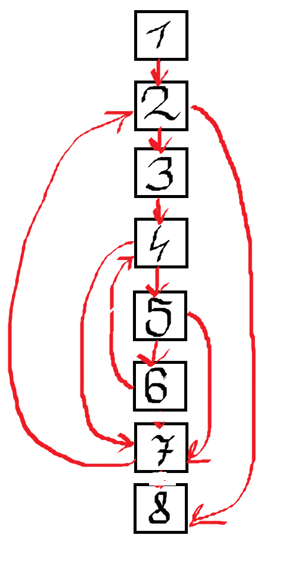

# Zadanie 7
```c
void insertion_sort(int arr[], int length)
{
    int j, temp;
    for (int i = 0; i < length; i++) 
    {
        j = i;
        while (j > 0 && arr[j] < arr[j-1]) 
        {
            temp = arr[j];
            arr[j] = arr[j-1];
            arr[j-1] = temp;
            j--;
        }
    }
}
``` 
```c
            i := 0                            #B1
FOR:        if i >= length goto FOR_END       #B2 
            j := i                            #B3
WHILE:      if j <= 0 goto WHILE_END          #B4
            t1 := j * 4                       
            t2 := arr + t1
			l := *t2
            t4 := t1 - 4
			t5 := arr + t4
			r := *t5
            if l >= r goto WHILE_END		  #B5
            temp := l               		  #B6
            l := r
			r := temp
			j := j - 1
            goto WHILE
WHILE_END:  i = i + 1                   	  #B7
            goto FOR
FOR_END:                              
.						                      #B8
```
